## Agent Sudo - TryHackMe 

> Written by [Ethical Hitler](https://github.com/EthicalHitler) :fire:

### Description

You found a secret server located under the deep sea. Your task is to hack inside the server and reveal the truth.

***

#### Task 1 :

Welcome to another THM exclusive CTF room. Your task is simple, capture the flags just like the other CTF room. Have Fun!

If you are stuck inside the black hole, post on the forum or ask in the TryHackMe discord.

Just Deploy your machine.

***

#### Task 2 : Enumerate

Scan the machine's IP using nmap to discover the open ports.

```bash
$ nmap -sC -sV -oN initialScan <MachineIP>
```

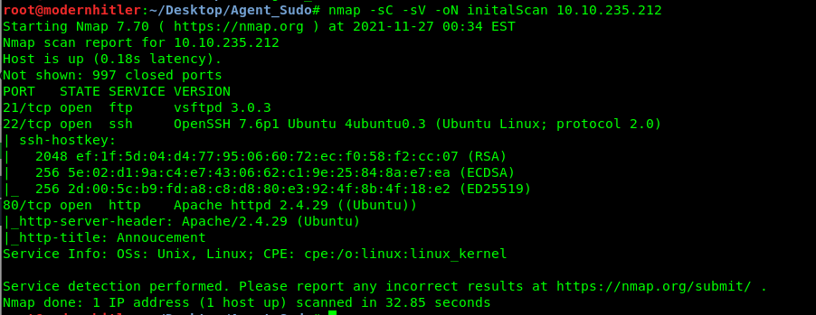

**1. How many open ports?**

```
3
```

Now here you can see that Port 80 which is open. So, let's check that and see what it returns.

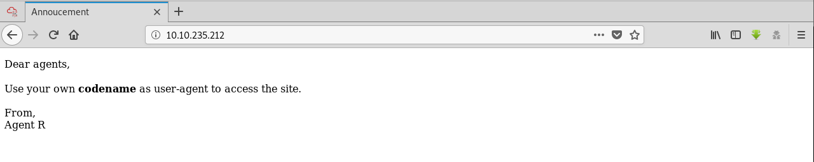

Hmm looks like there is a code name and that should be used as a custom user-agent to access the site. Interesting!

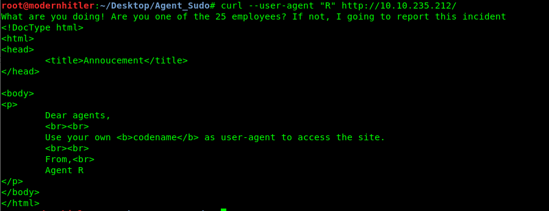

Its says "Are you one of the 25 employees?".Maybe it refers to the alphabets? Lets try it out.

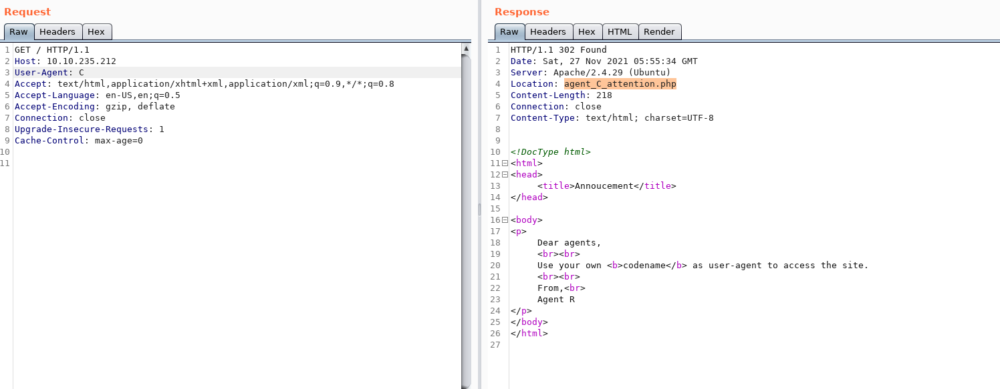

While trying out each alphabets, we got a hit with letter C and the response has a location named `agent_C_attention.php`. So if we visit that location we get

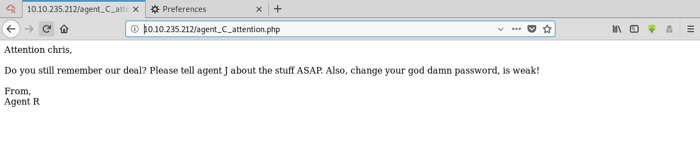

**2. How you redirect yourself to a secret page?**

```
user-agent
```

**3. What is the agent name?**

```
Chris
```

***

#### Task 3 : Hash cracking and brute-force

Done enumerate the machine? Time to brute your way out.

So we got a potential username of a agent. Let's check what's there in that open FTP server.

```bash
$ ftp <machineIP>
```


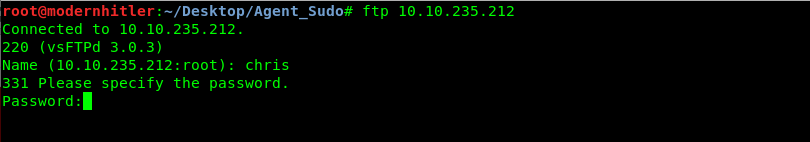

So we a password to login. Let's brute force it using hydra.

```bash
$ hydra -l chris -P /path/to/wordlist <machineIP> <service>
```


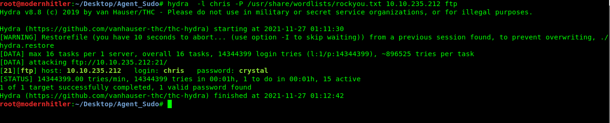

**1. FTP Password?**

```
crystal
```

So we found the password `crystal`. Now lets use this to login FTP Server.

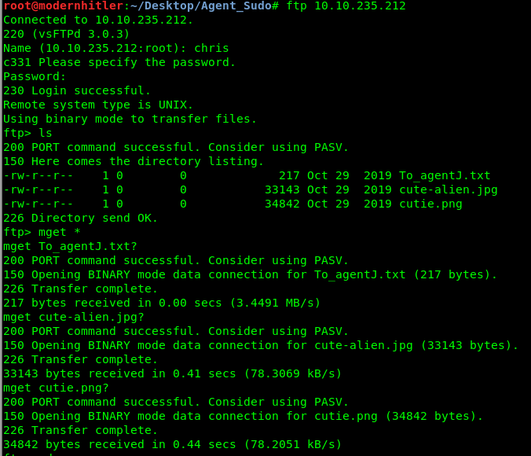

So there where 3 files in the server. so I downloaded them all to my local machine using Mget command.

so lets take a look at all the three files that we recovered.

**To_agentJ.txt**

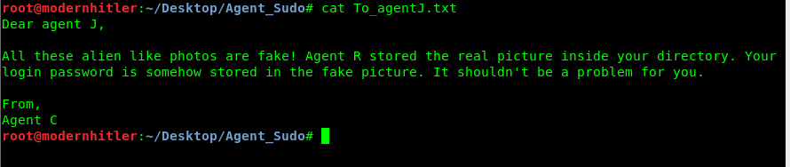

Looks like we have to use steghide or something to uncover the hidden message in those images. So out of suspicion I ran a binwalk command on one of those images `cutie.png`


so it returns that it has some text file in it. lets uncompress it and see what the text file contains.

After running , `zip2john 8702.zip > hash` and then using the hash file into johnny ( GUI version of john the ripper ) it gives use the password **`alien`**.

**2. Zip File Password**

```
alien
```

so after extracting the zip file, we got a text file which contains some hashed value. so I used `hashid <hashedValue>` to check what kind of hash it is and used online tool to decrypt it.

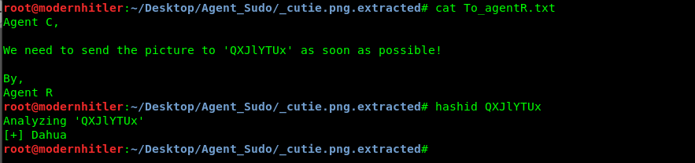

**3.Steg Password**

```
Area51
```

Now we can use this password to uncover the details from `cute-alien.jpg`.

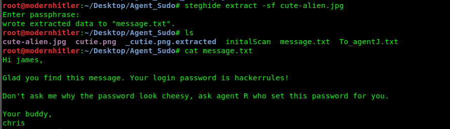

**4.Who is the other agent (in full name)**

```
james
```

**5. SSH Password**

```
hackerrules!
```

***

#### Task 4 : Capture the user flag

You know the drill.

Login into SSH using james credentials. 

```bash
$ ssh james@<machineIP>
```

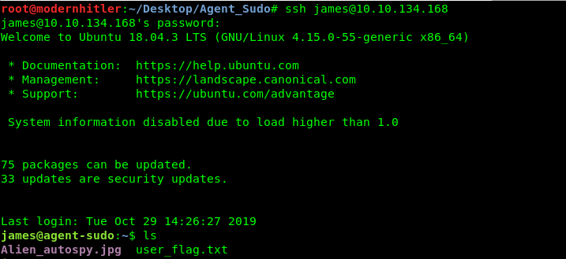

Just `cat` the user_flag.txt to reveal the flag.

**1.What is the user flag?**

```
b03d975e8c92a7c04146cfa7a5a313c7
```

Now after getting the user flag we also have a new file called `Alien_autospy.jpg`. So, lets download it and view on our local machine

```bash
$ sudo scp james@<machineIP>:Alien_autospy.jpg ~/Location/
```

> Note : this command should be executed in your attacking machine.

Ewww ! I don't want to share that image here because it's kinda weird. So I done a reverse image search using Google Images and found the name of it.

**2.What is the incident of the photo called?**

```
Roswell alien autopsy
```

***

#### Task 5 : Privilege Escalation

Enough with the extraordinary stuff? Time to get real.

So at first my goto to command to check for any vulnerabilities is to use `Sudo -l` to check for any process that runs with Root permissions.

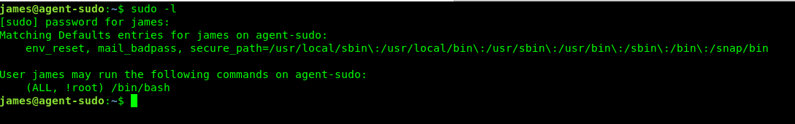

Woahh! That was unexpected , we have a `/bin/bash` running with All Root permissions. So if we check the CVE Number for this in exploit DB we get

**1. CVE number for the escalation **

```
CVE-2019-14287
```

So after checking the CVE , we have a ready exploit `Sudo -u#-1 /bin/bash`

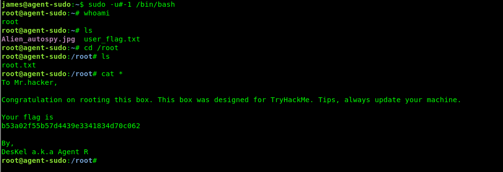

Hooray! We got the Root access. That exploit went really good.

**2. What is the root flag? **

```
b53a02f55b57d4439e3341834d70c062
```

**(Bonus) Who is Agent R? **

```
DesKel
```

***
