## Anonymous - TryHackMe

> Written by [Ethical Hitler](https://github.com/EthicalHitler) :fire:

### Description

Try to get the two flags!  Root the machine and prove your understanding of the fundamentals! This is a virtual machine meant for beginners. Acquiring both flags will require some basic knowledge of Linux and privilege escalation methods.

***

#### Task 1 : Pwn

**1.Enumerate the machine.  How many ports are open?**

First, Let's use Nmap port scanner to scan the target machine to see which ports are available to us.

```bash
$ nmap -sC -sV -oN initialScan <machineIP>
```

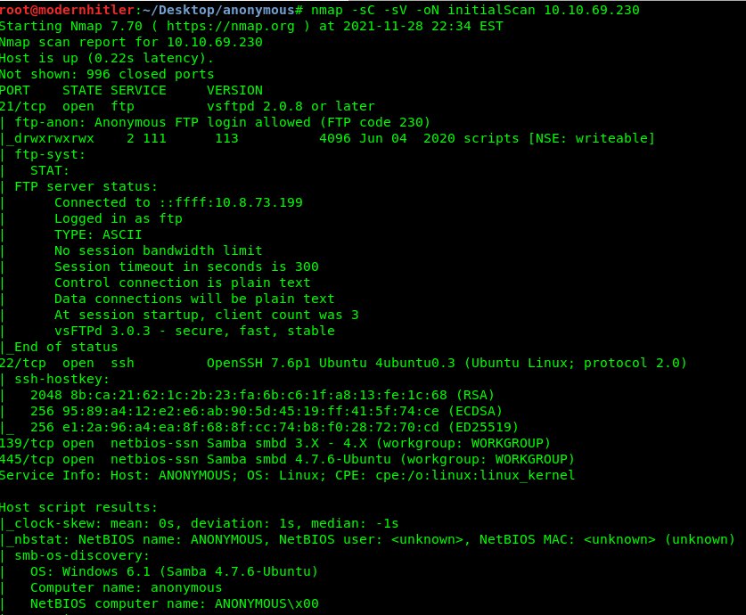

If you need an alternate for the nmap, use [Rustscan](https://github.com/RustScan/RustScan) which is faster than Nmap.

```bash
$ rustscan -a <machineIP>
```

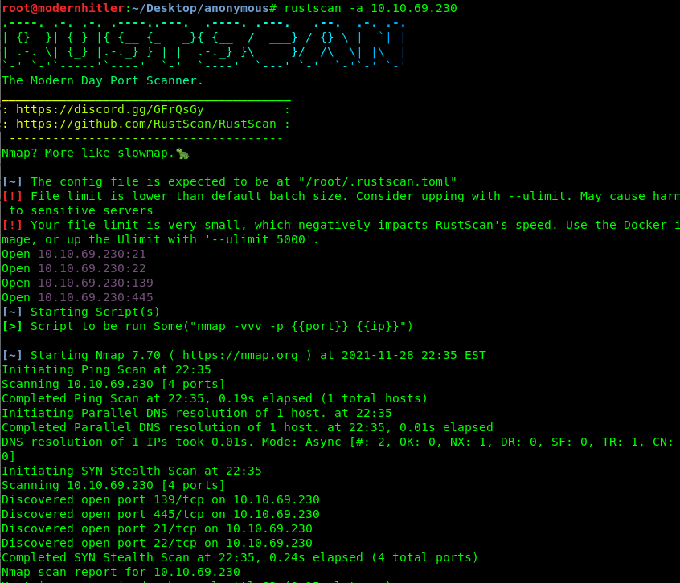


Answer :

```
4
```


***

**2. What service is running on port 21?**

```
ftp
```

***

**3. What service is running on ports 139 and 445?**

```
smb
```

***

**4. There's a share on the user's computer.What's it called?**

Generally to find the SMB Shares on a machine we use a tool called [Enum4Linux](https://github.com/CiscoCXSecurity/enum4linux)

```
$ enum4linux <machineIP>
```

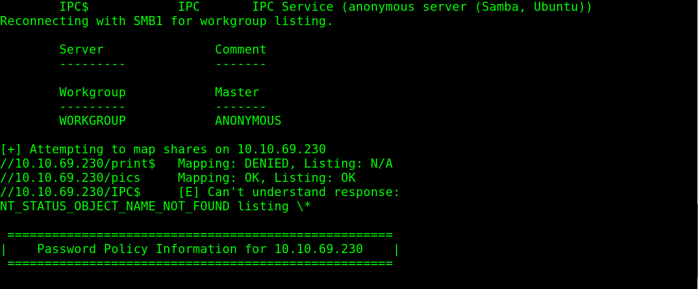

Running the tool gives us a the hidden share name 

Answer :

```
pics
```

****

**5. User.txt**

So now we have to gain access to the machine to access the user's flag. Let's go to the port scanning again. Here you can see there is a `FTP` server with an anonymous login allowed.

Hmm........So lets have a look there.

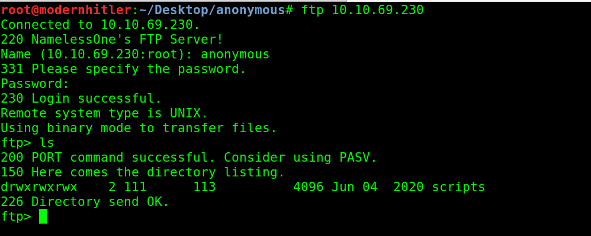

So there is a directory called `Scripts` , let's have a look into it.

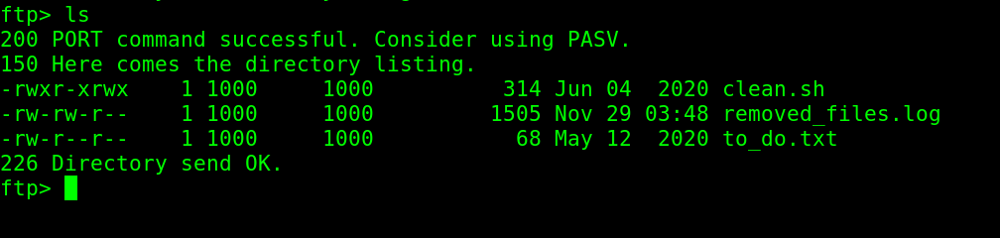

There are 3 files that are present so we transfer those files to our local machine and analyse them.

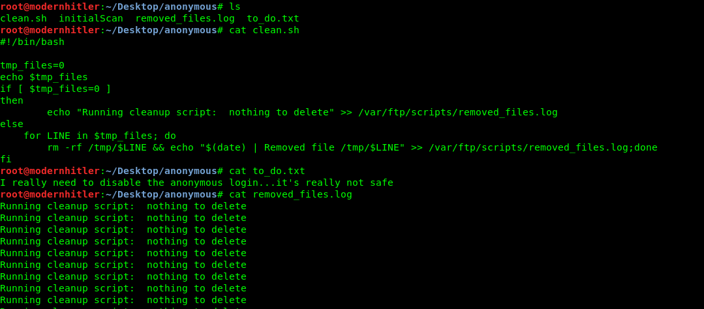

A script , a note and a log file.......so what can we do with this?

After sometime , I realised that log file has many entires what if the script is being executed like a time based or `Crontab` service. So , I replaced the whole script with a reverse shell script from [Reverse Shell Cheat Sheet | pentestmonkey](https://pentestmonkey.net/cheat-sheet/shells/reverse-shell-cheat-sheet)

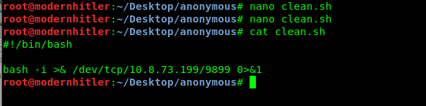

Also on the other hand I have started a `Netcat` listener on port 9899.

```
$ nc -lvp 9899
```

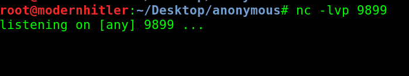

Then, I transfered the edited script to the target machine's FTP using `Put` command.

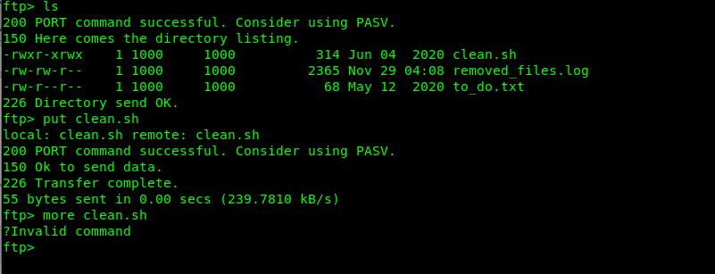

Woah! Now we got a reverse shell and also we got our `User.txt` flag.

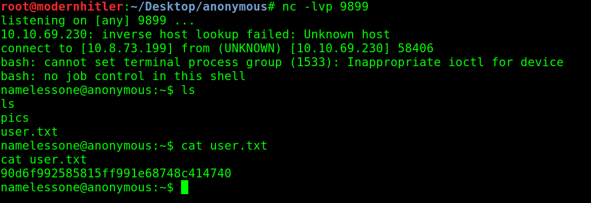

Answer : 

```
90d6f992585815ff991e68748c414740
```

****

**6. Root.txt**

Now its time to escalate our access to root user. Let's start by doing a manual enumeration and see if there are any binaries that gives us superuser permissions.

```
$ find / -perm -4000 2>/dev/null
```

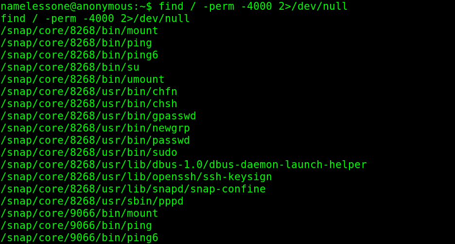

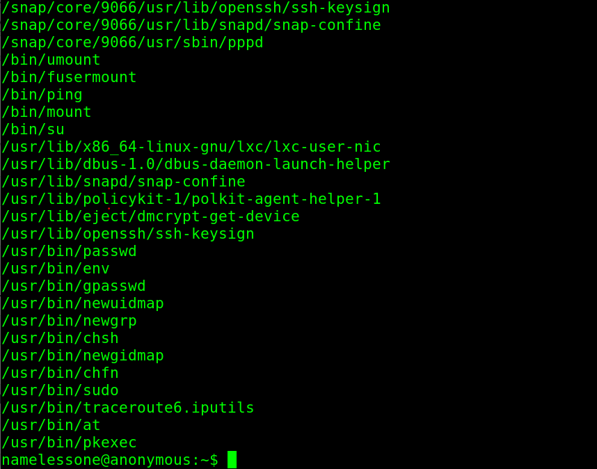

Now thats odd! There is a env which has a superuser permissions. Lets check [Gtfobins](https://gtfobins.github.io/)

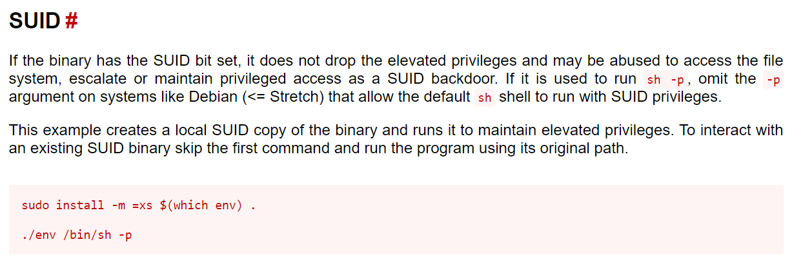

SUID - Set User ID is a type of permission that allows users to execute a file with the permissions of a specified user. 

So in this case , we used the binary **env** which has a SUID on it . By using env we exploited the SUID permissions and gained the Root access.

Nice....We are the superuser now!

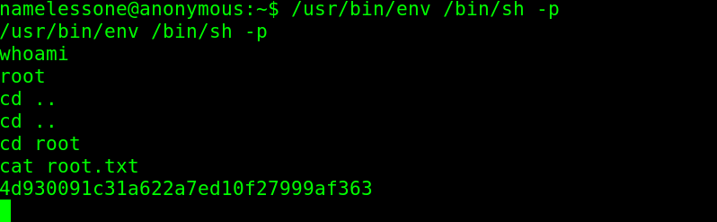

Answer : 

```
4d930091c31a622a7ed10f27999af363
```

****
