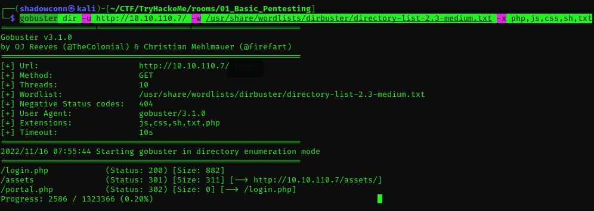

## Pickle Rick - TryHackMe

> Written by [ShadowConn](https://github.com/theshadowconn) :fire:

### Description

A must try for Rick and Morty Fans !.

***

**1.Deploy the machine and connect to network**

```
Done
```

***

**2.Find the services exposed by the machine**

To enumerate the machine, use Nmap to scan for open ports in the machine. If you need any alternate for nmap , use [Rustscan](https://github.com/RustScan/RustScan) which is a great tool for finding ports and It is also faster than nmap.

**Nmap**

```bash
$ nmap -sC -sV -oN initialScan <machineIP>
```


**Rustscan**


***

**3. Directory Enumeration**

Now we see there is an website running on `port 80` , so we can check any directories are hidden in the server.

For this directory bruteforcing , I generally use [gobuster](https://github.com/OJ/gobuster) with a directory-list-2.3-medium.txt wordlist.

```bash
$ gobuster dir -u <url> -w <wordlist>
```



Woah! so there is a hidden directory named `Assests` . Lets check what's inside.


Great, Now we have 7 files present in that directory. Now we will download that and view in our local machine and examine but nothing much.

Lets inspect our homepage and see anything is hiding there.


Now we have a possible Username `R1ckRul3s`

Lets check a low hanging stuffs like `/robots.txt` and found a random string `Wubbalubbadubdub`

Then, From the Directory Listing, We found a page called `Login.php`. Lets try these 2 as our creds in that.


 Success ! We are now into the site.

***

**4. Into the Site**

Here we have a text box , we can inject some linux commands here.


It returns our commands and has a text file. But still it filters certain commands like `Cat,more etc`. we can try `less`.


----

**FLAG 1 : What is the first ingredient Rick needs?**

```
mr. meeseek hair
```

***

**5. Finding 2nd Flag**

Since we have a command execution. We can try to get a revshell to our machine.


We got out shell. But we can't read the contents in the file since its owned by Root.

So we can try simple command to leverage the root permissions.

```bash
sudo -l
```


Here No password is required to change as root. so lets try `Sudo Bash`.

Hurray!. Since we got our root access. Its time to grab our second flag.


----

**FLAG 2 : Whats the second ingredient Rick needs??**

```
1 jerry tear
```

-----

**6. Finding Final Flag**

Navigate to root and grab the Final Flag.


---

**FLAG 3 : Whats the final ingredient Rick needs?**

```
fleeb juice
```

-----
